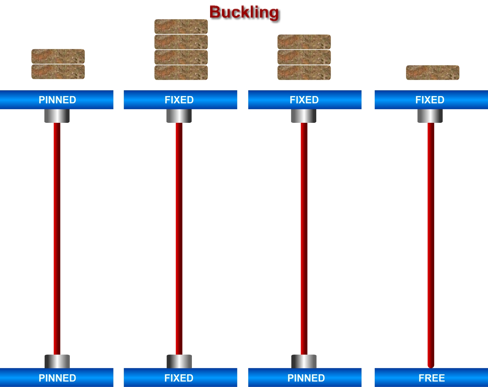

In general if a beam element is under a compressive load and its length is an order of magnitude larger than either of its other dimensions such a beam is called columns. Due to its size its axial displacement is going to be very small compared to its lateral deflection called buckling.

[Read more](http://bsa-iiith.vlabs.ac.in/exp4/Exp-4 Columns.pdf)